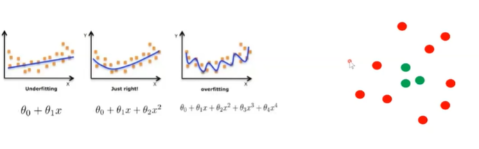

Llaisys：
- 从零写⼀个⼤模型推 理服务系统 课程阶段：部分基础功能 （张量、算⼦、模型结构） 的实现；简单的⽂本⽣成； 
- 项⽬阶段：搭建⼤模型推理 服务、智能芯⽚（含国产） 适配

InfiniLM：
- 基于Rust语⾔的⼤模 型推理系统 
- 项⽬阶段：向仓库共享代码， 包括但不限于添加和适配更多 模型、优化模型推理性能或增加单元测试

以⼤模型为核⼼，涉及计算机技术上下游各个⽅⾯ 
以服务的稳定性、⾼效率、可⽤性为⽬的 
对特定的模型结构、软硬件平台做针对性的优化
### 何为大模型
⼤模型是指具有⼤规模参数和复杂计算结构的机器学习 模型。这些模型通常由深度⼈⼯神经⽹络构建⽽成，在多 种领域和任务中具有⾮常强⼤的表⽰能⼒和泛化能⼒。
### 什么是人工神经网络
- ⼈⼯神经⽹络（Artificial Neural Network, ANN）是⼀种**模拟⽣物神经系统的计算模型**。由⼤量的节点（或称神经元）之间相互联接构成。每个神经元都包含线性计算和⾮线性计算。线性计算改变了输⼊信号的权重和偏移，⽽ ⾮线性计算则代表了神经元是否激活。

### 传统模型的局限
⽤**已知的数学公式**（如多项式），去拟合采样数据；希望寻找到⼀个能恰好通过这些数据点的参数集合，来完成建模；如果⽆法找到，就尽量逼近这些数据。

### 神经网络如何决策

- 一次线性计算
- ⼀次⾮线性计算（这⾥使⽤sgn函数） 

(1,1) (3,-1) ⽬标：输出为1则为绿点，输出为0则为红点

### 通过增加神经元支持更复杂的多边形

### 两处呢？

### 多种颜色

此时就不是一个数字，是一个向量

- 三层神经⽹络（即⼀个输⼊层、⼀个隐藏层和⼀个输出 层）在理论上可以近似任意复杂（有限维度）的决策边 界。
- 如果输⼊的维度更⾼，增加x的数量；如果输出的种类更多，增加y的数 量

训练
-  利用大量已知数据调整模型参数，让模型能更精准预测新数据，核心是让模型 “学” 会规律 。
- 借损失函数衡量预测误差，用梯度下降法等，朝着降低损失方向优化参数，同时需合理模型结构保障效果。

**推理**：
- 运用训练好（参数确定）的模型，对全新未知数据做预测，是训练成果的实际应用 ，把 “学” 到的能力用于新场景判断 。  
- 上方还有简单神经网络示意（输入\(x_1\)、\(x_2\)，经权重\(w_1\)、\(w_2\)加权求和，再经函数f映射输出y ），是理解训练推理的基础模型结构示例

### 大模型核心算子：矩阵乘
批量进⾏神经元的线性计算：
是⼤模型计算中总耗时最⻓的算⼦

### 大模型算子：激活函数

- Safe Sofemax 每次计算都是减去最大值

### 层归一化

- 减去平均值，除以方差
功能
- 提高计算稳定性
- 对向量进行取分

### 深度神经网络

- 深度神经⽹络通过更多层次的结构，可以**⽤较少的参数捕捉到更为复杂的特征关系，提升参数效率**

- ⼀些特殊的结构，如：CNN、RNN、Transformer等，可以引导模型⽤更少的参数捕捉特定的特征

- 7个特征足矣

